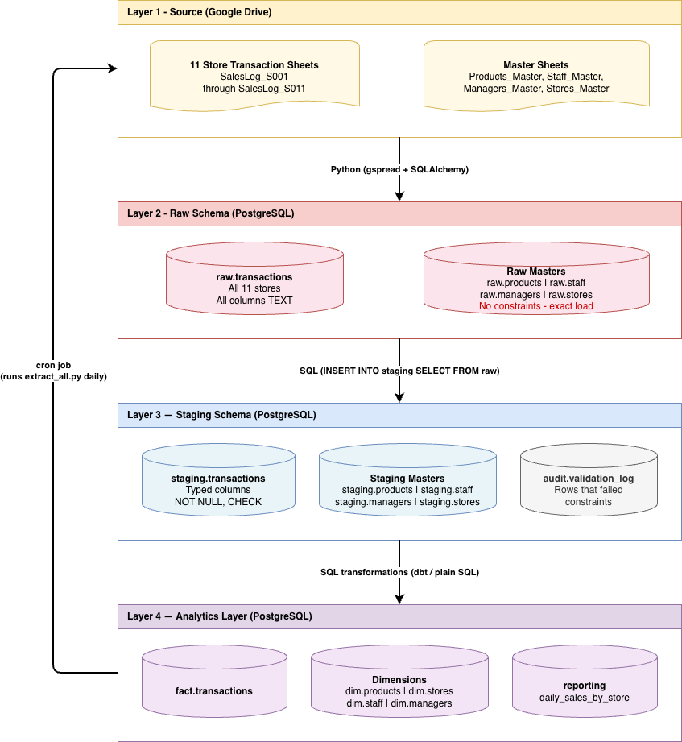

# MeridianMart Data Warehouse

## Business Problem
MeridianMart is a mid-sized retail business with 11 stores across Ghana.
Each store records daily transactions via Google Forms into separate Google
Sheets. With 15 disconnected spreadsheets, analysts cannot answer basic
cross-store questions like "Which store sold the most rice last week?"

## Solution
An ELT pipeline that consolidates all 15 data sources into a single
PostgreSQL data warehouse, enabling cross-branch reporting and analytics.

## Architecture

## Data Sources
| Source | Type | Details |
|--------|------|---------|
| Store transaction sheets ×11 | Google Sheets | Daily growing, one per store |
| Products_Master | Google Sheets | 65 products across 15 categories |
| Staff_Master | Google Sheets | 90 employees across 11 stores |
| Managers_Master | Google Sheets | 25 managers (store + regional) |
| Stores_Master | Google Sheets | 11 stores across 3 regions |

## Technology Stack
| Layer | Tool | Purpose |
|-------|------|---------|
| Source capture | Google Forms | Cashier data entry per store |
| Source storage | Google Sheets | Raw responses + reference data |
| Extraction | Python + gspread + SQLAlchemy | Pull from Sheets into PostgreSQL |
| Warehouse | PostgreSQL 17 | Raw, staging, and analytics schemas |
| Validation | PostgreSQL constraints + SQL | Type checking, NOT NULL, CHECK |
| Transformation | Plain SQL | Staging → fact/dimension → reporting |
| Orchestration | Python + cron | Daily automated pipeline run |
| Version control | Git / GitHub | Source control for all code |

## Project Structure
- `sql/` — DDL for raw and staging schemas, SQL transformations
- `scripts/` — Python extraction scripts
- `docs/` — Architecture diagram

## Setup Instructions
1. Clone this repo
2. Create virtual environment: `python3 -m venv .venv`
3. Activate it: `source .venv/bin/activate`
4. Install dependencies: `pip install -r requirements.txt`
5. Create `.env` file with your PostgreSQL credentials
6. Create database: `psql -U postgres -c "CREATE DATABASE meridianmart;"`
7. Run raw schema: `psql -U postgres -d meridianmart -f sql/raw_schema.sql`
8. Run extraction: `python3 scripts/extract_all.py`